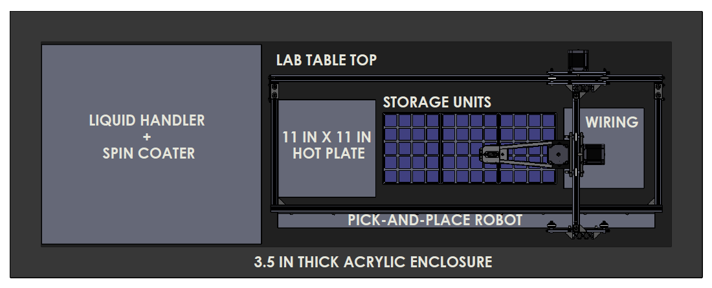
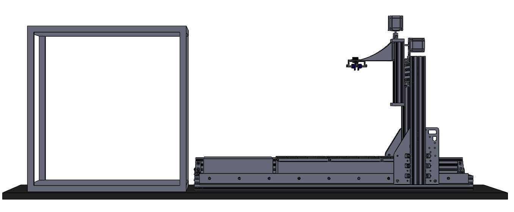
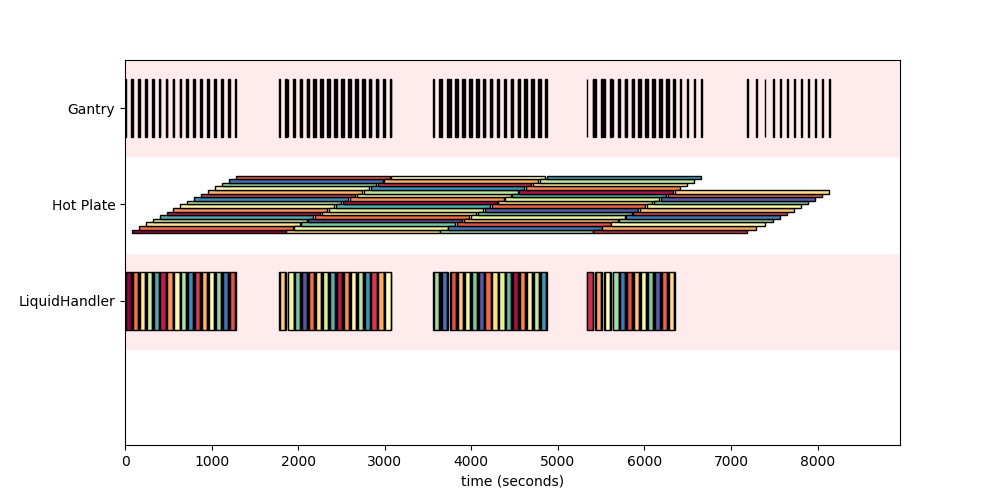
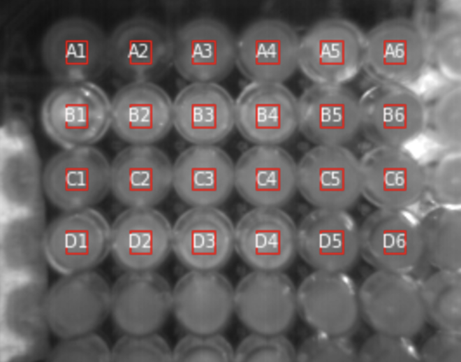
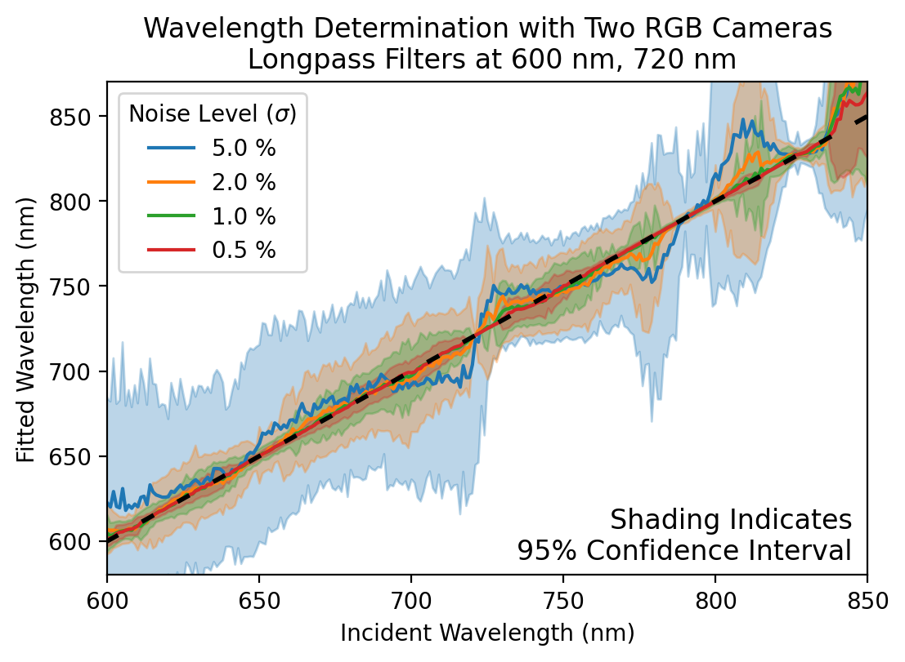
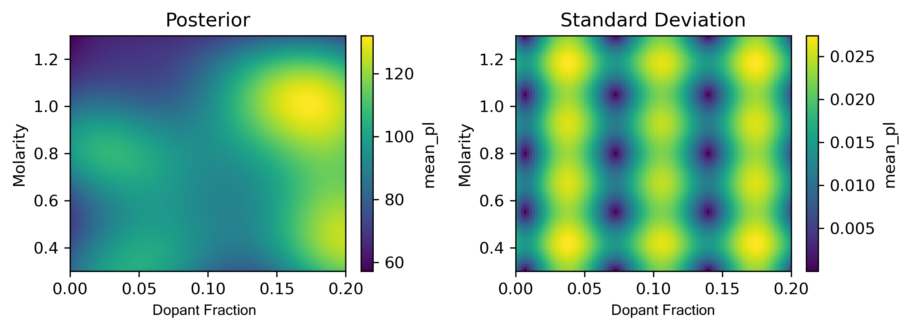
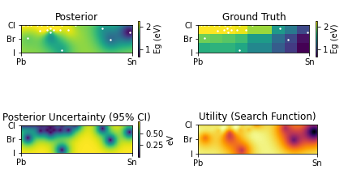

# Perovskite Automated Spin-Coating Assembly Line (PASCAL)

## Motivation

PASCAL is an automated platform for spin coating and annealing thin films onto small (>2x2 cm) substrates, aimed af increasing experimental throughput in the pursuit of designing better perovskite solar cells. Perovskite solar cells are infinitely tunable, as they can be formed with combinations of nearly half of the periodic table, presenting the excitement of limitless possibilities and the curse of dimensionality. With PASCAL, we aim to increase our experimental search rate by orders of magnitude, enabling a more systematic and exhaustive approach toward exploring the vast compositional space of interest for solar cell design.

## Hardware

### CAD schematics of PASCAL

### Liquid handler preparing precursor solution mixtures for a compositional search

### Liquid handler + spincoater working in conjunction to deposit solution onto substrate.

### Full Sample Fabrication

## Experimental Planning

- ternary of arbitrary composition

- stack ternary to add dimensions (spincoating conditions, anneal conditions, etc)

### Hardware Scheduling

## In-Line Characterization

- Widefield PL camera

- RGB Imaging for color determination

## Active Learning

### intra-run (narrow scope)

- bayesian approach to evaluating sample space

- update compositions of interest using in-line during experiment

### inter-run (wide scope)

- bayesian approach with operator input (XRD, UV-Vis, etc)
- find covariances between composition/fabrication conditions
- point towards broader design philosophies in perovskite solar cells